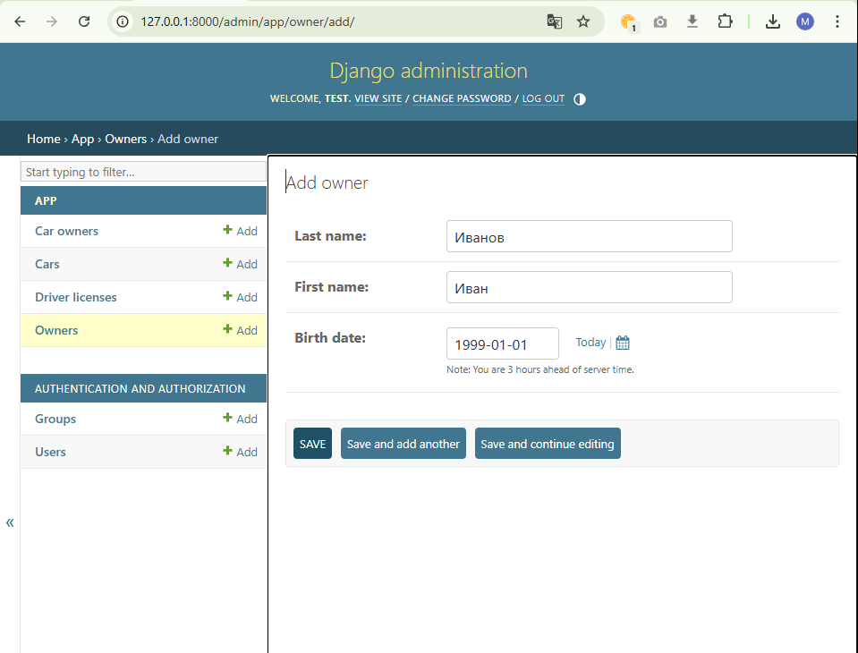

# Практическая работа 2.1

## Создание модели Django

Установка и первоначальная настройка

```bash
py -m venv lr2-env # Создание среды окружения
lr2-env\Scripts\Activate.ps1 # Активация виртуальной среды
deactivate # Выход из виртуального окружения
pip install django # Установка
pip freeze # Проверка
django-admin startproject blogfspo # Создание проекта 'blogfspo'
python manage.py startapp blog # Создание приложения 'app'
```

Основные классы в соответствии с заданием:


`manage.py`
```py
from django.db import models

# Create your models here.
class Owner(models.Model):
    last_name = models.CharField(max_length=30, null=False)
    first_name = models.CharField(max_length=30, null=False)
    birth_date = models.DateField(null=True)

class Car(models.Model):
    license_plate = models.CharField(max_length=15, null=False)
    brand = models.CharField(max_length=20, null=False)
    model = models.CharField(max_length=20, null=False)
    color = models.CharField(max_length=20, null=True)

class CarOwner(models.Model):
    owner_id = models.ForeignKey(Owner, null=True, on_delete=models.CASCADE)
    car_id = models.ForeignKey(Car, null=True, on_delete=models.CASCADE)
    date_start = models.DateField(null=False)
    date_end = models.DateField(null=True)

class DriverLicense(models.Model):
    owner_id = models.ForeignKey(Owner, null=False, on_delete=models.CASCADE)
    driver_license = models.CharField(max_length=10, null=False)
    type = models.CharField(max_length=10, null=False)
    date_issued = models.DateField(null=False)
```

Команды для создания миграций:
```bash
python manage.py makemigrations # Создание миграций
python manage.py migrate # Применение
```

## Заполнение

*Заполнение таблицы средствами админ панели*

`admin.py`
```py
from django.contrib import admin
from .models import Owner, CarOwner, Car, DriverLicense

# Register your models here.
admin.site.register(Owner)
admin.site.register(CarOwner)
admin.site.register(Car)
admin.site.register(DriverLicense)
```

Создание суперпользователя и запуск сервера
```bash
python manage.py createsuperuser # auth: test, test test@test.com
python manage.py runserver # Запуск сервера
```


## Контроллер

*Создание контроллеров для обработки данных*

`views.py`
```py
from django.http import Http404
from django.shortcuts import render
from .models import Owner

# Create your views here.
def owner_info(request, owner_id):
    try:
        owner = Owner.objects.get(id = owner_id)
    except Owner.DoesNotExist:
        raise Http404("Owner not found")

    return render(request, 'app/ownersearch.html', {'owner': owner})
```

## Адресация

`urls.py` в проекте
```py
from django.contrib import admin
from django.urls import path, include

urlpatterns = [
    path('admin/', admin.site.urls),
    path('app/', include('app.urls')),
]
```

`urls.py` в приложении
```py
from django.urls import path
from . import views

urlpatterns = [
    path('owner/<int:owner_id>/', views.owner_info, name='owner_info')
]
```

## Добавление записей и тестирование

*Панель администратора `Django`*

`http://127.0.0.1:8000/admin/`


Добавление записи в Owners


Вывод информации

`http://127.0.0.1:8000/app/owner/2`


