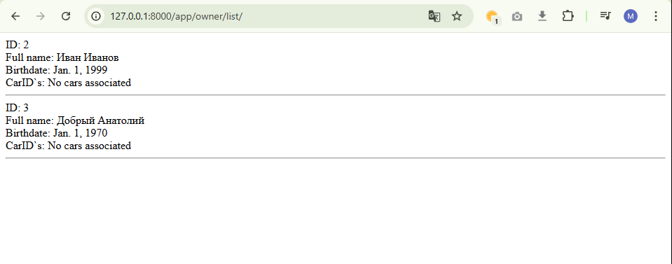
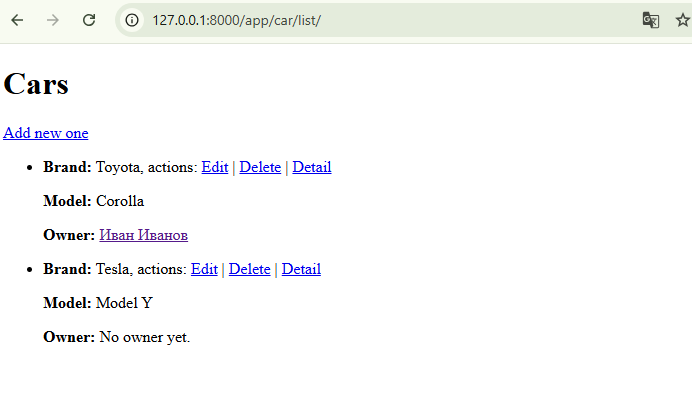
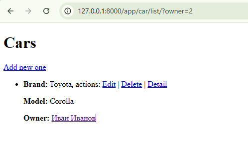
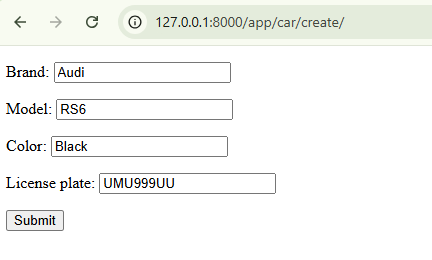

# Практическая работа 2.2

## Реализация связи мнонгие ко многим

*Текущая реализация моделей*
```py
from django.db import models

# Create your models here.
class Owner(models.Model):
    last_name = models.CharField(max_length=30, null=False)
    first_name = models.CharField(max_length=30, null=False)
    birth_date = models.DateField(null=True)

class Car(models.Model):
    license_plate = models.CharField(max_length=15, null=False)
    brand = models.CharField(max_length=20, null=False)
    model = models.CharField(max_length=20, null=False)
    color = models.CharField(max_length=20, null=True)

class CarOwner(models.Model):
    owner_id = models.ForeignKey(Owner, null=True, on_delete=models.CASCADE)
    car_id = models.ForeignKey(Car, null=True, on_delete=models.CASCADE)
    date_start = models.DateField(null=False)
    date_end = models.DateField(null=True)

class DriverLicense(models.Model):
    owner_id = models.ForeignKey(Owner, null=False, on_delete=models.CASCADE)
    driver_license = models.CharField(max_length=10, null=False)
    type = models.CharField(max_length=10, null=False)
    date_issued = models.DateField(null=False)
```

Нужно учесть, что

1. `Owner` Хранит данные о владельцах автомобилей.
2. `Car`: Хранит данные об автомобилях
3. `CarOwner`: Хранит данные о владении

`Owner` будет свзяан с `Car` связью `многие ко многим` через `CarOwner`

Обновленные модели:
```py
from django.db import models

# Create your models here.
class Owner(models.Model):
    last_name = models.CharField(max_length=30, null=False)
    first_name = models.CharField(max_length=30, null=False)
    birth_date = models.DateField(null=True)
    cars = models.ManyToManyField('Car', through='CarOwner')

class Car(models.Model):
    license_plate = models.CharField(max_length=15, null=False)
    brand = models.CharField(max_length=20, null=False)
    model = models.CharField(max_length=20, null=False)
    color = models.CharField(max_length=20, null=True)
    owners = models.ManyToManyField(Owner, through='CarOwner')

class CarOwner(models.Model):
    owner_id = models.ForeignKey(Owner, null=True, on_delete=models.CASCADE)
    car_id = models.ForeignKey(Car, null=True, on_delete=models.CASCADE)
    date_start = models.DateField(null=False)
    date_end = models.DateField(null=True)

class DriverLicense(models.Model):
    owner_id = models.ForeignKey(Owner, null=False, on_delete=models.CASCADE)
    driver_license = models.CharField(max_length=10, null=False)
    type = models.CharField(max_length=10, null=False)
    date_issued = models.DateField(null=False)
```

## Практическое задание (по задаче 2)

1. Реализовать вывод всех владельцев функционально. Добавить данные минимум от трех владельцах. Должны быть реализованы контроллер (views) и шаблоны (temlates).
2. Реализовать вывод всех автомобилей, вывод автомобиля по id, обновления на основе классов. Добавить данные минимум о трех автомобилях. Должны быть реализованы контроллер (views) и шаблоны (temlates).

Вывод владельцев функционально

`views.py`
```py 
def owner_list(request):
    context = {}

    context['owner'] = Owner.objects.all()

    return render(request, 'app/ownerlist.html', context)
```

`ownerlist.html`
```html 
<!DOCTYPE html>
<div class="main">

    

    ID: {{ data.id }}<br/>
    Full name: {{ data.first_name }} {{ data.last_name }}<br/>
    Birthdate: {{ data.birth_date }}<br/>
    CarID`s:
    
        {{ car.id }}
    
        No cars associated
    
    <br/>
    <hr/>

    

</div>
```


Вывод с параметром и без

`views.py`

```py 
class CarListView(ListView):
    model = Car

    def get_queryset(self):
        owner_id = self.request.GET.get('owner')

        if owner_id:
            try:
                owner_id = int(owner_id)

                car_ids = CarOwner.objects.filter(owner_id=owner_id).values_list('car_id', flat=True)

                return Car.objects.filter(id__in=car_ids)

            except ValueError:
                return self.model.objects.none()

        return Car.objects.all()
```

`car_list.html`
```html
<!-- car_list.html -->
<!DOCTYPE html>
<html lang="en">

<head>
  <meta charset="UTF-8">
  <meta name="viewport" content="width=device-width, initial-scale=1.0">
  <title>Car List</title>
</head>

<body>
  <h1>Cars</h1>
  <a href="/car/create/">Add new one</a>
  <ul>
    
    <li>
        <strong>Brand:</strong> {{ car.brand }}, actions:
        <a href="/car/{{ car.id }}/update/">Edit</a> |
        <a href="/car/{{ car.id }}/delete/">Delete</a> |
        <a href="/car/{{ car.id }}/">Detail</a>
        <p><strong>Model:</strong> {{ car.model }}</p>
        <p><strong>Owner:</strong>
            
                    <a href="?owner={{ car_owner.owner_id.id }}">
                        {{ car_owner.owner_id.first_name }} {{ car_owner.owner_id.last_name }}</p>
                    </a>
            
                No owner yet.
            
    </li>
    
    <li>No Cars yet.</li>
    
  </ul>
</body>

</html>
```
*без параметра*

*с параметром* `?owner=2`


## Работа с формами и предствалениями

`forms.py`
```py 
class PostForm(forms.ModelForm):

    class Meta:
        model = Car
        template_name = 'car_create.html'

        fields = [
            'brand',
            'model',
            'color',
            'license_plate'
        ]
```

Маршрут
```py 
    path('car/create/', create_view, name='car_create'),
```

Шаблон
```html 
<!-- car_crerate.html -->
<!DOCTYPE html>
<form method="POST" enctype="multipart/form-data">

    <!-- Security token -->
    

    <!-- Using the formset -->
    {{ form.as_p }}

    <input type="submit" value="Submit">
</form>
```

